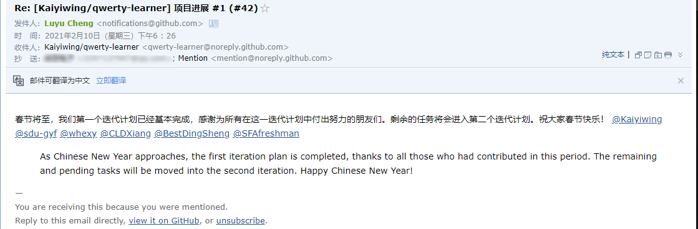

### 获取菜鸡教程javaApi
向开源项目[qwerty-learner](https://github.com/Kaiyiwing/qwerty-learner)提交PR
> 还是第一次给开源项目提交PR,还是一个千star的项目,纪念一下,虽然仅仅是贡献了几个词库json(✪ω✪)
>
* 目标URL的eg :https://www.runoob.com/java/java-arraylist.html
* 爬取网页中的表格
* 所得json示例:[java-array-list](./菜鸟教程javaDocs爬取/java-arraylist.json)
### 微信机器人:自动回复新年祝福
> 基于wxpy微信机器人库
> **需要微信号可以登录微信网页版**
* 如果收到含有"年"字的私聊,视为新年祝福语
* 从祝福语数组和图片中随机选取祝福语+图片回复新年祝福并将好友加入已回复列表

